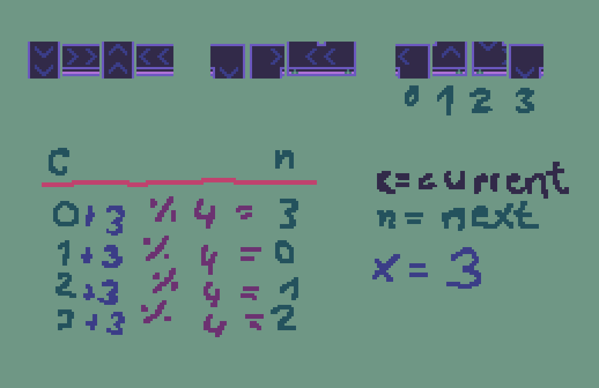
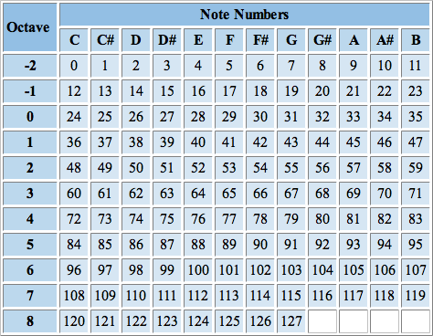

# Dev Documentaion for Nebula FM

## Pixel Art
### Color Palette
. 
By bly32-1x

### Rotation Guideline
Sprites in the tilemap.png are rotated in the following order (except for the convoyer belt corners)

⬆️ ➡️ ⬇️ ⬅️

## Code
### Conveyor Belts

#### Autotiling
Idea: 
- place default rotation "DOWN"
- On every belt placement check if the player places the new belt next to another one and rotates new belt based on some rules
- afterwards a private function checks if the newly placed belt forms a corner with a present one and if so, one of the sprites is replaced by the right corner sprite

#### Flow Direction of NotePackages
This section shows how allowed rotation of the next belt  is calculated.

Example CASE: current belt is "Corner (Backward)" and next belt is also "Corner (Backward)"


(This image was used to develop a mapping from current rotations to next rotations)
To receive the right rotation of the next belt in this case the formula is

```
curr_rotation + 3 % 4 = next_rotation
```

## Midi Player
The full note to numbers mapping of midi files.


