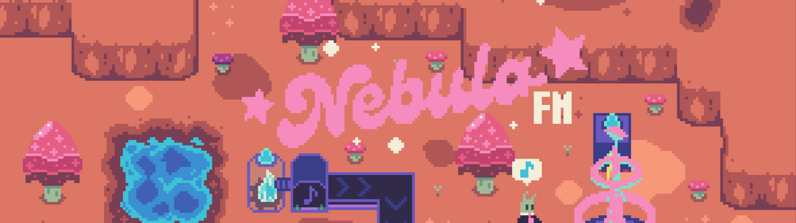
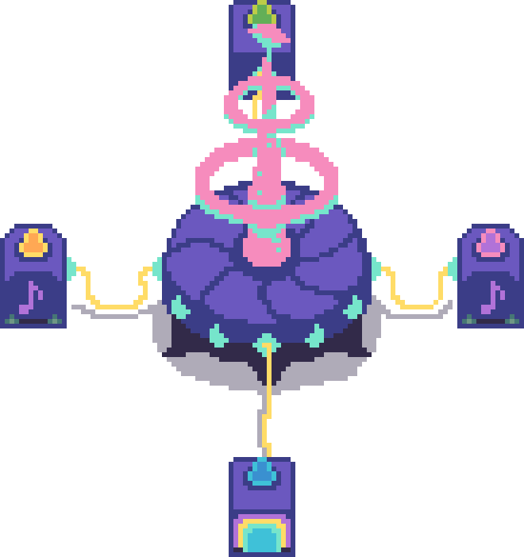

# Nebula FM ── .✦

(https://ldjam.com/events/ludum-dare/58))

	 _   _      _           _         ______ __  __ 
	| \ | |    | |         | |       |  ____|  \/  |
	|  \| | ___| |__  _   _| | __ _  | |__  | \  / |
	| . ` |/ _ \ '_ \| | | | |/ _` | |  __| | |\/| |
	| |\  |  __/ |_) | |_| | | (_| | | |    | |  | |
	|_| \_|\___|_.__/ \__,_|_|\__,_| |_|    |_|  |_|

Nebula FM is our entry for Ludum Dare 58! ᯓ★ This time we worked as a team of four and were divided between creating a rhythm game or a strategy game, so we decided to combine both. The result is an intergalactic music factory simulator where you build production lines to broadcast beats across space. We experimented with timing systems, conveyor logic, and musical resource chains to bring the concept to life. Some features, such as the conveyor belts, are still experimental due to the jam’s time limit, but the core idea is already fully playable.

## About The Game
The intergalactic radio station Nebula FM is losing listeners fast. Across the galaxy, no one is tuning in anymore. Then mysterious sources of resonance are discovered on distant worlds. You are sent to harvest these signals and turn them into the sickest space beats the universe has ever heard. Build production lines, refine raw resonance, and keep the rhythm alive, because the future of the sound of the universe depends on you!

### Genres
   

### Features
- Procedural map generation
- Factory automation

### Controls
| Action | Key / Mouse |
|---------|--------------|
| Select factory building from hotbar | *Click on desired object* |
| Rotate left | **Q** |
| Rotate right | **E** |
| Place selected building | **Left Click** |
| Toggle delete cursor | **D** |
| Delete factory or conveyor | **Left Click** (while in delete mode) |
| Exit delete mode / Deselect building | **Esc** |
| Zoom in or out | **Scroll Wheel** |
| Drag camera | **Hold Right Click** |

### Development
Nebula FM is built with Godot 4.5 and was originally created during Ludum Dare 58.
Development continues beyond the jam version, with the current focus on refining the overall game loop, adding new content such as the intro, outro, and quests, and ongoing bug fixing and polishing.

## Contributors 
[★ iocutus]()  
[★ pumpkinchariot]()  
[★ prodcautious]()  
[★ bognari]()

## Credits
font: https://ggbot.itch.io/robtronika-font  
font: https://jotson.itch.io/gravity-pixel-font  
color palette: bly32-1x  
Dot Matrix Diagonal Reveal Shader: https://godotshaders.com/shader/dot-matrix-diagonal-reveal-shader/  
